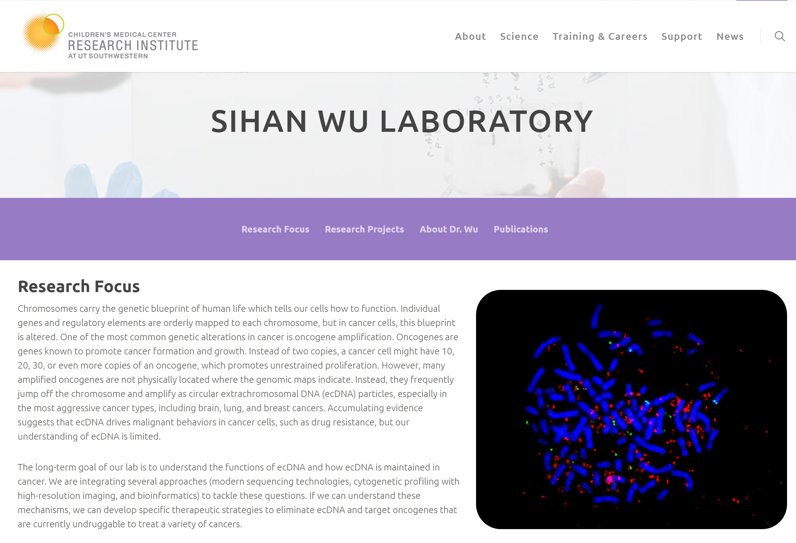
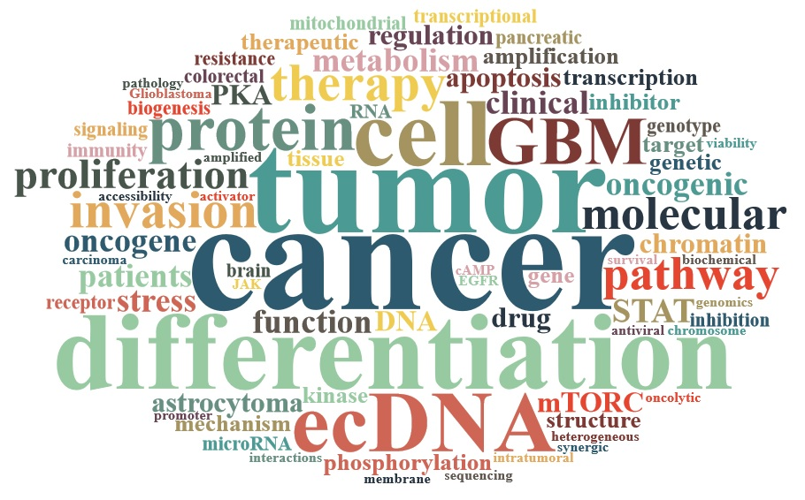
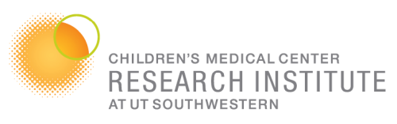
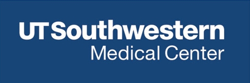
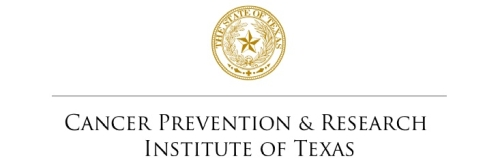

# Sihan Wu Laboratory
### Children's Medical Center Research Institute at UT Southwestern
### [:pencil2: We are hiring! Please see details below. :pencil2:](#Multiple-postdoc-positions-opening)

### Please visit our lab website here:

### :point_right: https://cri.utsw.edu/scientists/sihan-wu-laboratory/ :point_left:

 

## Team
### Sihan Wu 吴思涵, Ph.D.
#### Assistant Professor, CPRIT Scholar, Forbeck Scholar, Principal Investigator | [ORCID](https://orcid.org/0000-0001-8329-7492), [Google Scholar](https://scholar.google.com/citations?user=O1e4RfAAAAAJ&hl=en), [Twitter](https://twitter.com/SihanSean)
##### Department: [Children's Medical Center Research Institute](https://cri.utsw.edu) | Pediatrics | [Harold C. Simmons Comprehensive Cancer Center](https://www.utsouthwestern.edu/departments/simmons/research/)
##### Graduate program: [Cancer Biology](https://www.utsouthwestern.edu/education/graduate-school/programs/cancer-biology/)

I am interested in and have an extensive background in cancer genetics and genomics. After graduating from Sun Yat-sen University (SYSU) majored in Biotechnology, I obtained my Ph.D. training at SYSU,  where I studied genetic alterations in brain tumor. I then initiated my postdoctoral research at the Ludwig Institute for Cancer Research, UC San Diego, and Stanford University, under Dr. Paul Mischel's mentorship, and studied the structure and function of ecDNA in cancer, revealing its circular shape and the functional impact of its unique physical conformation. In 2021, I was awarded by the Cancer Prevention & Research Institute of Texas and joined the faculty of Children’s Medical Center Research Institute at UT Southwestern as an assistant professor in pediatrics. I am enthusiastic about studying the molecular function and molecular basis of ecDNA, and trying to leverage this knowledge to develop effective approaches to eliminate ecDNA in cancer as novel oncogene targeting strategies. 

### Wenyue Liu 刘文跃, Ph.D.
#### Postdoc | [ORCID](https://orcid.org/0000-0003-2197-7788), [Google Scholar](https://scholar.google.com/citations?user=kmOWmtoAAAAJ&hl=en), [LinkedIn](linkedin.com/in/wenyue-liu-a63a75218)

Dr. Wenyue Liu obtained his Ph.D. from University of Science and Technology of China (USTC) in 2021, where he focused on studying the molecular mechanisms of microtubule nucleation from non-centrosomal microtubule organizing centers. Fascinated by the amazing role of extrachromosomal DNA (ecDNA) in cancer, Dr. Liu joined the Wu lab as a postdoctoral researcher at UT Southwestern in 2021. Here, he is trying to deepen the understanding of the molecular function and basis of ecDNA in cancer.

### Collin Gilbreath
#### Research Assistant II / Lab Manager

Collin received his bachelor's degree in Biology from the University of Texas at Dallas. Before joining CRI, he worked as a research technician for three years in Dr. Ganesh Raj’s lab at UT Southwestern studying the DNA damage repair pathway in prostate cancer and its therapeutic targets. At CRI, he is a research assistant and lab manager for the Wu lab. Outside of work, he enjoys going to concerts, traveling, and trying different restaurants.

### Jun Yi (Stanley) Lim
#### Rotation Student

## Representative publications

* Circular ecDNA Promotes Accessible Chromatin and High Oncogene Expression. [Nature, 2019.](https://www.nature.com/articles/s41586-019-1763-5)
* Extrachromosomal DNA Is Associated with Oncogene Amplification and Poor Outcome across Multiple Cancers. [Nature Genetics, 2020.](https://www.nature.com/articles/s41588-020-0678-2)
* ecDNA Hubs Drive Cooperative Intermolecular Oncogene Expression. [Nature, 2021 (in press).]
* Extrachromosomal DNA: An Emerging Hallmark in Human Cancer. [Annual Review of Pathology: Mechanisms of Disease, 2022. (in press).]

 
 

## Fundings
| Title                                                  | Agency                                          | Period    |
|:-------------------------------------------------------|:------------------------------------------------|----------:|
| Recruitment of First-Time Tenure-Track Faculty Members | Cancer Prevention & Research Institute of Texas | 2021-2026 |

## Multiple postdoc positions opening!
The Sihan Wu lab, based in Children's Medical Center Research Institute (CRI) at UT Southwestern, has multiple postdoctoral positions opening now. We study the molecular function and molecular basis of extrachromosomal DNA (ecDNA) in human cancer, including its replication, transcription, and repair, and try to develop effective approaches to tackle these mechanisms to eliminate ecDNA in cancer as therapeutic strategies. Applicants who are intellectually curious and interested in science that bridges cancer genetics, genomics, epigenetics, metabolism, and signal transduction, are encouraged to apply.

Postdoctoral scientist in the lab will conduct cutting-edge research in a protected, interactive, highly collaborative, and well-funded environment, with access to shared facilities including sequencing, bioinformatics, imaging, metabolomics, flow cytometry, molecular pathology, mouse genome engineering, and beyond. 

Visit our department website through: [https://cri.utsw.edu/](https://cri.utsw.edu/)

Funding announcement can be found in the [CPRIT website](https://cprit.texas.gov/news-events/articles/cancer-prevention-research-institute-of-texas-awards-695-million-in-new-grants/)

Qualifications for these positions include Ph.D. or M.D. degree(s) (or anticipate receiving their degree in the near future) with less than 2 years of postdoctoral experience. Candidates with relevant training involving DNA and chromatin biology, genetics, genomics, epigenetics, signal transduction, cancer metabolism, and bioinformatics, especially with both wet-lab and dry-lab experience, are particularly encouraged to apply. 

Interested applicants should submit the following documents **assembled into one PDF file** to ``Sihan.Wu@UTSouthwestern.edu`` (entitled with ***"Postdoc_Application_Your_Name"*** for auto-archiving)

1. A Cover Letter describing your interest in this position.
2. A CV listing your education, training background, publications, and skill set.
3. One to two Reference Letter(s), including from your current mentor(s).
4. \*A 2-page Research Statement / Proposal summarizing your current research achievement and / or future research interest. (* Optional item. You can submit it later upon request.)

The recruitment is on a rolling basis until all positions are filled. We evaluate every applicant equally. Successful candidates will be invited for a remote interview with the PI.

