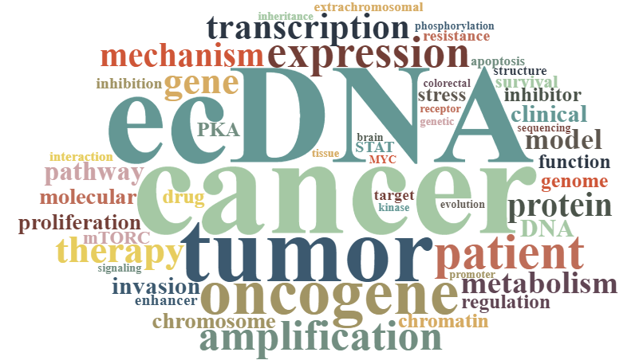

# Sihan Wu Laboratory
### Children's Medical Center Research Institute at UT Southwestern

<!---
### [:pencil2: We are hiring! Please see details below. :pencil2:](#Postdoc-Positions-in-Cancer-Genetics-Genomics-and-Immunology)
-->

### Please visit our lab website here:

### :point_right: https://cri.utsw.edu/scientists/sihan-wu-laboratory/ :point_left:

 

## Representative publications

* Acquired Cross-resistance in Small Cell Lung Cancer due to Extrachromosomal DNA Amplification of MYC paralogs. [Cancer discovery, 2024.](https://aacrjournals.org/cancerdiscovery/article/doi/10.1158/2159-8290.CD-23-0656/734805/Acquired-Cross-resistance-in-Small-Cell-Lung) [:link: PMC link](https://pubmed.ncbi.nlm.nih.gov/38386926/)
* Extrachromosomal DNA in the cancerous transformation of Barrett’s oesophagus. [Nature, 2023.](https://www.nature.com/articles/s41586-023-05937-5) [:link: PMC link](https://pubmed.ncbi.nlm.nih.gov/37046089/)
* The Evolutionary Dynamics of Extrachromosomal DNA in Human Cancers. [Nature genetics, 2022.](https://www.nature.com/articles/s41588-022-01177-x) [:link: PMC link](https://www.ncbi.nlm.nih.gov/pmc/articles/pmid/36123406/)
* Extrachromosomal DNA: An Emerging Hallmark in Human Cancer. [Annual Review of Pathology: Mechanisms of Disease, 2022.](https://www.annualreviews.org/doi/10.1146/annurev-pathmechdis-051821-114223) [:link: PMC link](https://www.ncbi.nlm.nih.gov/pmc/articles/PMC9125980/)
* ecDNA Hubs Drive Cooperative Intermolecular Oncogene Expression. [Nature, 2021.](https://www.nature.com/articles/s41586-021-04116-8) [:link: PMC link](https://www.ncbi.nlm.nih.gov/pmc/articles/pmid/34819668/)
* Extrachromosomal DNA Is Associated with Oncogene Amplification and Poor Outcome across Multiple Cancers. [Nature Genetics, 2020.](https://www.nature.com/articles/s41588-020-0678-2) [:link: PMC link](https://www.ncbi.nlm.nih.gov/labs/pmc/articles/PMC7484012/)
* Circular ecDNA Promotes Accessible Chromatin and High Oncogene Expression. [Nature, 2019.](https://www.nature.com/articles/s41586-019-1763-5) [:link: PMC link](https://www.ncbi.nlm.nih.gov/labs/pmc/articles/PMC7094777/)

 
 

## Team
### Sihan Wu 吴思涵, Ph.D.
#### Assistant Professor, CPRIT Scholar, Forbeck Scholar, Principal Investigator | [ORCID](https://orcid.org/0000-0001-8329-7492), [Google Scholar](https://scholar.google.com/citations?user=O1e4RfAAAAAJ&hl=en), [Twitter](https://twitter.com/SihanSean)
##### Department: [Children's Medical Center Research Institute](https://cri.utsw.edu) | [Pediatrics](https://www.utsouthwestern.edu/departments/pediatrics/) | [Harold C. Simmons Comprehensive Cancer Center](https://www.utsouthwestern.edu/departments/simmons/research/)
##### Graduate program: [Cancer Biology](https://www.utsouthwestern.edu/education/graduate-school/programs/cancer-biology/) | [Genetics, Development and Disease](https://www.utsouthwestern.edu/education/graduate-school/programs/genetics-and-development/)

I am interested in and have an extensive background in cancer genetics and genomics. After graduating from Sun Yat-sen University (SYSU) majored in Biotechnology, I obtained my Ph.D. training at SYSU,  where I studied genetic alterations in brain tumor. I then initiated my postdoctoral research at the Ludwig Institute for Cancer Research, UC San Diego, and Stanford University, under Dr. Paul Mischel's mentorship, and studied the structure and function of ecDNA in cancer, revealing its circular shape and the functional impact of its unique physical conformation. In 2021, I was awarded by the Cancer Prevention & Research Institute of Texas and joined the faculty of Children’s Medical Center Research Institute at UT Southwestern as an assistant professor in pediatrics. I am enthusiastic about studying the molecular function and molecular basis of ecDNA, and trying to leverage this knowledge to develop effective approaches to eliminate ecDNA in cancer as novel oncogene targeting strategies. 

### Yoon Jung Kim, Ph.D.
#### Assistant Professor | [ORCID](https://orcid.org/0000-0002-2942-294X)

Dr. Yoon Jung Kim obtained her Ph.D. from Korean Advanced Institute of Science and Technology (KAIST) in 2007, where she developed a pH shock method to enhance the production of antibiotic and anticancer agents by studying gene regulation in <em>Streptomyces sp.</em> She then started her postdoctoral research at the Yale School of Medicine in 2008, under Dr. Tae-Hoon Kim’s mentorship to study the roles of chromatin structure, enhancer function, and CTCF function in gene regulation. She joined Dr. Jian Xu’s lab in the Children’s Research Institute at UT Southwestern Medical Center in 2019 as a research scientist and developed a tool (LAMPS) to examine how phase separated condensates modulate transcription at the endogenous locus. Additionally, she studied the role of hematopoietic cell-specific enhancers in governing cell lineage. In 2023, she joined Sihan Wu’s lab to study ecDNA biology, focusing on the mitotic segregation mechanism of ecDNA. In addition, she also serves as the Manager of the next-gen sequencing core. Outside of work, she loves to cook and enjoy food. She also loves to workout, run, and do Pilates and Yoga.  

### Jun Yi Stanley Lim
#### Grad student | [ORCID](https://orcid.org/0000-0003-4160-7434), [Twitter](https://twitter.com/stanleylim93)

Stanley received his bachelor's degree in Life Sciences with a specialization in Molecular and Cell Biology from the National University of Singapore. Before joining CRI, he worked as a research assistant in Dr. David Virshup's lab at Duke-NUS Medical School, focusing on studying Wnt signaling regulated pathways in cancer. At CRI, he is a graduate student in the Wu lab. Outside of work, Stanley enjoys exploring new places and is proficient in the Japanese language.

### Yipeng Xie 谢依朋
#### Grad student | [ORCID](https://orcid.org/0000-0002-7454-126X)

Yipeng got his bachelor’s degree in Biological Sciences from Wuhan University (WHU), China. He has a broad interest in transcription regulation. Before he started his Ph.D. training, he worked as an undergrad research assistant with Dr.Yi Liu at UTSW, focusing on codon usage bias. He joined the Wu lab in 2023 as a graduate student, where he studies the mechanisms of ecDNA segregation and how it may be targeted for cancer therapy. Outside of work, he enjoys traveling around different countries and watching suspense movies. 

### Kailiang Qiao 乔锴亮, Ph.D.
#### Postdoc | [ORCID](https://orcid.org/0000-0002-6097-0338)

Dr. Kailiang Qiao earned his Ph.D. from Nankai University in 2021, where he focused on studying the molecular mechanisms of cancer progression in hepatocellular carcinoma. During his Ph.D. training, he was very interested in genomics instability and systems biology. Therefore, he joined Wu lab in 2022, where he currently studies ecDNA and the mechanism of genomic instability in cancer.

### Xiaohui Sun 孙晓辉, Ph.D.
#### Postdoc | [ORCID](https://orcid.org/0000-0001-8218-1885)

Dr. Xiaohui Sun obtained his Ph.D. from Peking Union Medical College (PUMC) in 2020. Before joining CRI, he focused on studying the mechanisms of DNA damage response and repair. He paid particular attention to DNA double-strand breaks induced by ionizing radiation and studied the relationship between DNA damage response and radiosensitivity. Dr. Sun joined the Wu lab as a postdoctoral researcher at UT Southwestern in 2022. Here, he is trying to understand how extrachromosomal DNA (ecDNA) responses to damage and how this mechanism may be leveraged to treat ecDNA-driven cancers.In his spare time, he likes singing and biking.

### Qing-Lin Yang 杨清林, Ph.D.
#### Postdoc (co-mentored by [Dr. Zhijian 'James' Chen](https://www.james-zhijian-chen-lab.org/)) | [ORCID](https://orcid.org/0000-0001-6532-5699)

Dr. Qing-Lin Yang obtained his Ph.D. degree from the Center for Excellence in Molecular Cell Science (CEMCS, formerly known as Shanghai Institute of Biochemistry and Cell Biology, SIBCB), Chinese Academy of Sciences, in 2020. During his Ph.D. training, he focused on dissecting the mechanism of DNA demethylation and developing CRISPR-based gene editing tools. In 2023, he joined the Zhijian “James” Chen lab at the Molecular Biology department, co-mentored by Sihan Wu at CRI. Here, he studies the mechanism by which ecDNA-driven cancer evades immune surveillance.

### Collin Gilbreath
#### Research Associate / Lab Manager | [ORCID](https://orcid.org/0000-0002-8683-983X)

Collin received his bachelor's degree in Biology from the University of Texas at Dallas. Before joining CRI, he worked as a research technician for three years in Dr. Ganesh Raj’s lab at UT Southwestern studying the DNA damage repair pathway in prostate cancer and its therapeutic targets. At CRI, he is a research assistant and lab manager for the Wu lab. Outside of work, he enjoys going to concerts, traveling, and trying different restaurants.

<!---
## Alumni
| Name                                 | Previous role                 | Current position    |
|:-------------------------------------|:------------------------------|:--------------------|
|                 |              |     |
-->

## Fundings
### Ongoing
| Title                                                    | Agency                                          | Period    |
|:---------------------------------------------------------|:------------------------------------------------|----------:|
| Catalyst Award                                           | American Cancer Society                         | 2025-2025 |
| Gilead Sciences Research Scholoar Program in Solid Tumor | Gilead Sciences                                 | 2023-2025 |
| Recruitment of First-Time Tenure-Track Faculty Members   | Cancer Prevention & Research Institute of Texas | 2021-2026 |
| Cancer Grand Challenges                                  | Cancer Research UK & National Cancer Institute  | 2022-2027 |
### Past
| Title                                                    | Agency                                          | Period    |
|:---------------------------------------------------------|:------------------------------------------------|----------:|
| Moody Medical Research Institute Innovation Award        | Moody Medical Research Institute                | 2022-2024 |

## Shared resources
### [WuLabScripts](https://github.com/sihanwusean/WuLabScripts)

A collection of haring bioinformatic scripts developed by Sihan Wu lab.

<!---
## Postdoc Positions in Cancer Genetics, Genomics, and Immunology

Postdoctoral positions are available in the laboratories of Drs. Zhijian ‘James’ Chen lab and Sihan Wu at UT Southwestern Medical Center. Postdocs recruited via this pathway will be housed and supported in the Chen lab in the Molecular Biology department, and co-mentored by Dr. Wu at the Children’s Research Institute.

The Chen lab studies innate immune sensing and signaling of nucleic acids, focusing on the cGAS-STING pathway of cytosolic DNA sensing. This pathway has been shown to be important for many physiological and pathological processes. The lab is interested in dissecting the signaling mechanisms of the cGAS pathway as well as its role in immune defense against tumor development. 

The Wu lab studies the molecular functions and molecular dependencies of extrachromosomal DNA (ecDNA) in human cancer, including its replication, segregation, transcription, and repair, with an aim to develop effective approaches to tackle these mechanisms to eliminate ecDNA in cancer as therapeutic strategies. 

The Chen and Wu labs have recently received generous support from the Cancer Grand Challenges grant funded by Cancer Research UK and the US National Cancer Institute. The two labs will co-mentor postdocs to study how ecDNA cancers evade the immune system. Applicants who are intellectually curious and interested in science that bridges cancer genetics, genomics, and immunology are encouraged to apply.

Postdoctoral scientist in the lab will conduct cutting-edge research in a protected, interactive, highly collaborative, and well-funded environment, with access to shared facilities including sequencing, bioinformatics, imaging, metabolomics, flow cytometry, molecular pathology, and mouse genome engineering.

Qualifications for these positions include Ph.D. and/or M.D. degree(s) (or anticipate receiving their degrees in the near future) with less than 2 years of postdoctoral experience. Candidates with relevant training involving DNA and chromatin biology, genetics, genomics, epigenetics, signal transduction, immunology, and bioinformatics, especially with both wet-lab and dry-lab experience, are particularly encouraged to apply.

Interested applicants should submit the following documents **assembled into one PDF file** to ``Zhijian.Chen@UTSouthwestern.edu`` and ``Sihan.Wu@UTSouthwestern.edu`` 

1. A Cover Letter describing your interest in this position.
2. A CV listing your education, training background, publications, and skill set.
3. Two Reference Letters, including from your current mentor(s).
4. \*A 2-page Research Statement / Proposal summarizing your current research achievement and / or future research interest. (* Optional item. You can submit it later upon request.)

For more information about our lab, please visit our websites:

https://www.utsouthwestern.edu/labs/chen-james/

https://www.james-zhijian-chen-lab.org/

https://cri.utsw.edu/scientists/sihan-wu-laboratory/

https://github.com/sihanwusean/sihanwulab
-->

